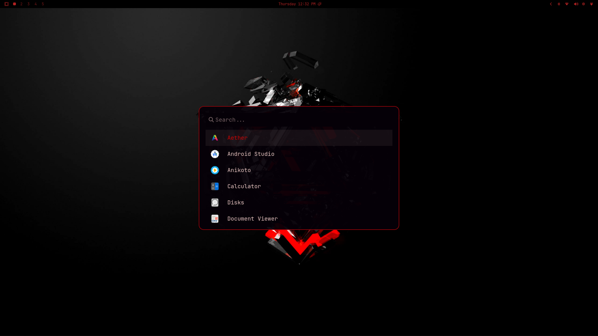
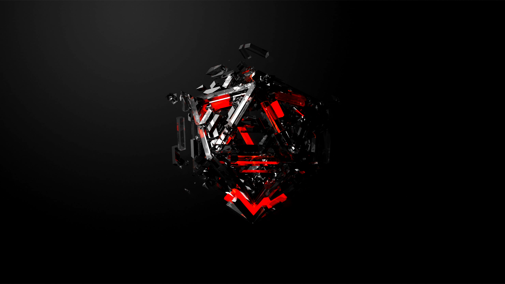

<div align="center">
  
  

  # 🌙 Blood-Moon Theme
  
  [](https://opensource.org/licenses/MIT)
  [](https://omarchy.org/)
  [](https://github.com/mehulrathod-0666/omarchy-blood-moon-theme/stargazers)

  A deep, vibrant red and black theme for Omarchy.  
  *Customized from the original `pink-blood` theme by [ITSZXY](https://github.com/ITSZXY).*
</div>

---

## 🎨 Features

- **Hyprland:** Custom active/inactive borders and specialized group/tab styling.
- **Waybar:** Fully themed status bar with Blood-Moon colors.
- **Terminals:** Native support for Alacritty, Kitty, Foot, and Ghostty.
- **Browsers:** Automatic theming for Chrome, Chromium, and Firefox.
- **Wallpapers:** 6 curated backgrounds included in the `/backgrounds` folder.
- **App Support:** Mako (Notifications), SwayOSD, Walker (Launcher), Neovim, VSCode, and Btop.

## 🚀 Installation

### Main System Theme
Apply the theme instantly using the Omarchy CLI. Browser themes for Chrome and Firefox will be applied automatically!

```bash
omarchy theme install https://github.com/mehulrathod-0666/omarchy-blood-moon-theme.git
```

---

## 🖼️ Wallpaper Gallery
This theme includes 6 curated backgrounds. You can cycle through them using `omarchy theme bg next`.

<div align="center">
  <table>
    <tr>
      <td align="center"><br><sub>0main</sub></td>
      <td align="center"><br><sub>cloudMoon</sub></td>
      <td align="center"><br><sub>sakuraMoon</sub></td>
    </tr>
    <tr>
      <td align="center"><br><sub>red2077</sub></td>
      <td align="center"><br><sub>redIconcude</sub></td>
      <td align="center"><br><sub>cude</sub></td>
    </tr>
  </table>
</div>

## 📜 License
This project is licensed under the **MIT License**. See the [LICENSE](LICENSE) file for details.

---

<div align="center">
  <sub>Built with ❤️ for the Omarchy Community</sub>
</div>
